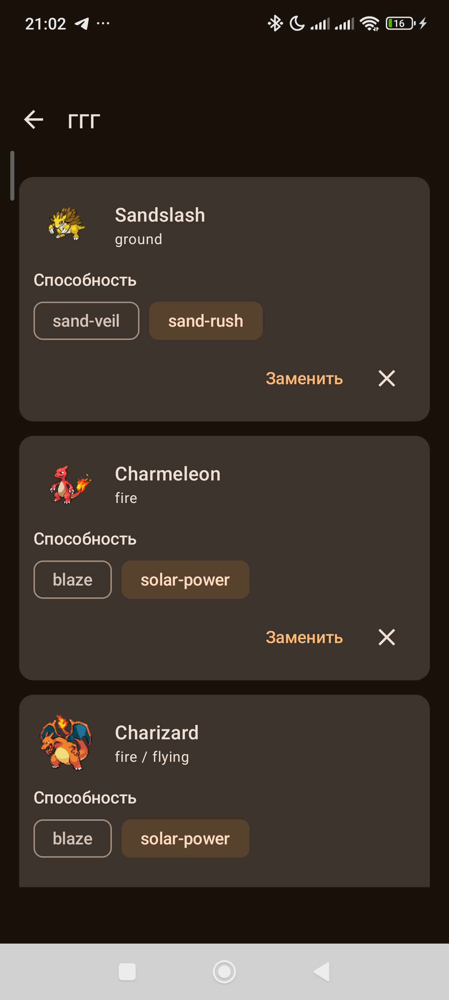
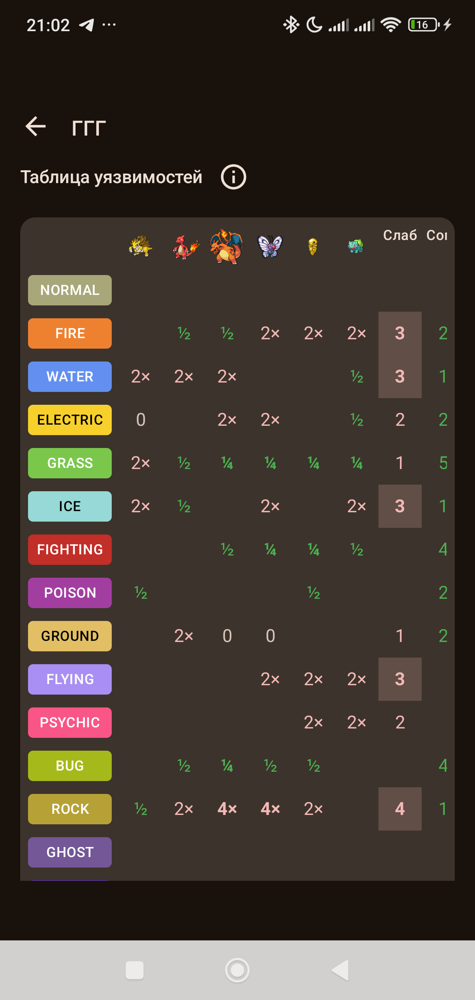
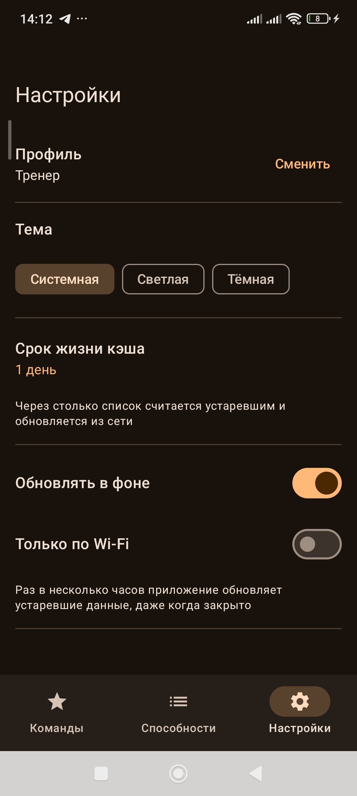
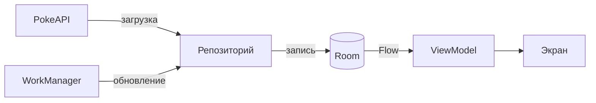

# PokeAbilityApp

## ФИО, группа
Ведёхин Никита Васильевич, группа Б9123-09.03.03(4)

## О приложении
Планировщик команд для Pokémon. Пользователь собирает команду из шести покемонов и выбирает каждому способность. Приложение показывает, сколько урона каждый покемон получит от каждого типа атаки, и выделяет типы, от которых увеличенный урон получают три покемона и больше. Так слабые места видны до боя, и можно пересобрать команду. В приложении есть справочник способностей с поиском и избранным.

Так команды собирают игроки соревновательного Pokémon: на официальных турнирах VGC и в онлайн-боях на Pokémon Showdown. Ближайший аналог - веб-сервис Marriland Team Builder.

## Скриншоты
| Команда | Матрица уязвимостей | Настройки |
|---|---|---|
|  |  |  |

## API
**PokéAPI** (https://pokeapi.co/)
- `/api/v2/ability` и `/api/v2/ability/{id}`: список и описание способностей
- `/api/v2/pokemon` и `/api/v2/pokemon/{id}`: список покемонов, их типы и способности
- `/api/v2/type/{id}`: таблица эффективности типов

## Что добавлено
- Экран команд покемонов и экран редактора команды
- Матрица уязвимостей команды
- Локальные профили с раздельными данными и настройками
- Кэш в Room с политикой актуальности (TTL), работа без сети
- Экран настроек и экран истории просмотров
- Фоновая обработка через WorkManager: обновление кэша, предзагрузка команд, чистка истории
- Нижняя навигация: Команды, Способности, Настройки. История просмотра способностей открывается из вкладки способностей
- Тесты 

## Новые пользовательские данные
Пользовательские данные хранятся в Room и разделены по профилям через внешний ключ `profileId` с каскадным удалением:

| Таблица | Что хранит |
|---|---|
| `profiles` | локальные профили |
| `teams` | команды профиля |
| `team_slots` | связь команды с покемоном: позиция 0..5 и выбранная способность |
| `favourites` | избранные способности, теперь у каждого профиля свои |
| `history_entries` | история просмотров способностей |

Кэш контента: `cached_abilities`, `cached_pokemon`, `pokemon_abilities`, `type_effectiveness`. У записей есть время загрузки, по нему считается устаревание.

Настройки лежат в DataStore: тема, срок жизни кэша, фоновое обновление, обновление только по Wi-Fi, ведение истории и срок её хранения. Общим для всех хранится только id активного профиля.

## Сценарии
1. **Сборка команды и анализ покрытия.** Создать команду, выбрать покемонов в слоты, назначить способности. Приложение строит матрицу, которая показывает, сколько урона каждый покемон получит от каждого типа атаки. Типы, которые бьют по трём и более членам команды, выводятся как главные угрозы.
2. **Локальные профили.** Создание, выбор и удаление профиля. Команды, избранное, история и настройки у каждого профиля свои, активный профиль восстанавливается после перезапуска. При удалении профиля его данные удаляются каскадом, последний профиль удалить нельзя.
3. **История просмотров.** Пользователь открывает способность из списка или через поиск, и она записывается в историю активного профиля. История открывается из вкладки способностей. В настройках историю можно выключить и задать срок хранения.

## Offline-first

- Room единственный источник данных для экранов. Репозитории отдают `Flow` из базы, сетевые запросы только записывают в базу.
- Политика актуальности: данные считаются устаревшими, если с момента загрузки прошло больше срока жизни кэша из настроек. Если кэш свежий, сеть не запрашивается.
- Кнопка повтора обновляет данные принудительно, без учёта срока.
- Если обновление не удалось, а в кэше есть данные, экран продолжает их показывать без ошибки.
- Поиск способности сначала смотрит в кэш и идёт в сеть только при отсутствии записи. Ответ 404 означает «не найдено», а сбой сети показывается как ошибка.
- Описание способности, типы и способности покемонов, таблица типов тоже кэшируются, поэтому расчёт покрытия работает без сети.

## Фоновая обработка
WorkManager подключён через Hilt (`HiltWorkerFactory`), расписание ставит класс `BackgroundWork` при запуске приложения.

| Воркер | Когда | Зачем |
|---|---|---|
| `CacheRefreshWorker` | раз в 6 часов, при наличии сети или только по Wi-Fi | обновляет устаревшие списки способностей, покемонов и таблицу типов |
| `TeamPrefetchWorker` | после выбора покемона в слот, когда есть сеть | догружает типы и способности покемонов команды и таблицу типов, чтобы матрица работала офлайн |
| `HistoryCleanupWorker` | раз в сутки | удаляет у каждого профиля записи истории старше его срока хранения |

При выключении фонового обновления задача отменяется, при смене «только по Wi-Fi» меняется условие сети. 

## Тесты
Всего 52 юнит-теста и 63 инструментальных.

**Бизнес-логика**
- `CoverageAnalyzerTest` (13): множители для одного и двух типов, иммунитеты типов и способностей, угрозы и порог, порядок угроз, множители по каждому покемону
- `CachePolicyTest` (6): устаревание данных по сроку жизни
- `SettingsRepositoryImplTest` (7): сохранение настроек, разделение по профилям, чтение настроек другого профиля
- `MappersTest` (2)

**Реактивная и экранная логика**
- `AbilityListViewModelTest` (13): список из кэша, ошибка без кэша, сохранение списка при сбое обновления, избранное, фильтр, повтор, подгрузка страниц, ошибки поиска
- `TeamEditorViewModelTest` (6): шесть слотов, ожидание таблицы типов, угрозы, levitate снимает уязвимость к земле, данные покемона запрашиваются один раз
- `ProfilesViewModelTest` (5): создание, выбор и удаление профилей
- `AbilityListScreenTest` (6, Compose UI): отображение списка, нажатие на элемент, ошибки и пустые состояния

**Offline, синхронизация и фон**
- `AbilityRepositoryImplTest` (11) и `PokemonRepositoryImplTest` (6): работа с кэшем без сети, учёт срока жизни, принудительное обновление, сохранение кэша при сбое, направление таблицы типов
- `HistoryRepositoryImplTest` (7): запись истории, разделение по профилям, удаление устаревших записей
- `WorkersTest` (4): предзагрузка команды, повтор и отказ при ошибке сети, обновление кэша без принуждения
- `BackgroundWorkTest` (4): постановка, отмена и условия сети для фоновых задач

**Room**
- `MigrationTest` (9): каждая миграция и полная цепочка с сохранением данных
- `FavouriteDaoTest` (6), `TeamDaoTest` (7), `ProfileDaoTest` (3): запросы, разделение по профилям, каскадное удаление

## Ограничения
- Используется актуальная таблица типов, выбор поколения игр не поддерживается
- Из способностей учитываются только дающие полный иммунитет к типу. Способности, которые лишь уменьшают урон, в расчёт не входят
